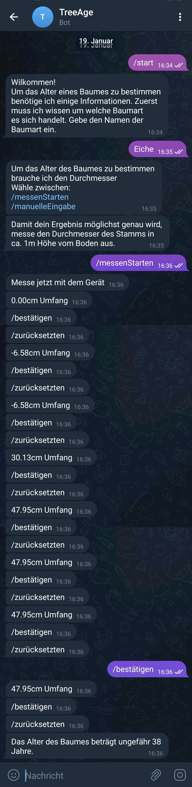

[<- Übersicht](README.md)

# Prototyp 

## Aufbau:

Der Boot läuft auf dem ESP32 mit dem auch gleichzeitig gemessen wird. Der ESP 32 muss sich hierfür über Wlan im Internet befinden um mit Telegram zu kommunizieren. Die Abfrage aller relevanten Daten erfolgt über das Keyboard das die Bot API anbietet oder über direkte Texteingaben. Im folgenden Flowchart wird der Ablauf erklärt:

## Code:

Low-Fid Prototyp Code: [TreeAgeBot](https://github.com/Julian-Katz/TreeAge-Telegram-Bot)

Dieser ist in einem Status in dem der Bot getestet werden kann. Momentan wird sich auf die Grundlegende Funktion konzentriert Formulierungen und Buttons sind noch nicht final. Der genaue Ablauf ist in der Evaluation festgehalten.

### Gesamtablauf
