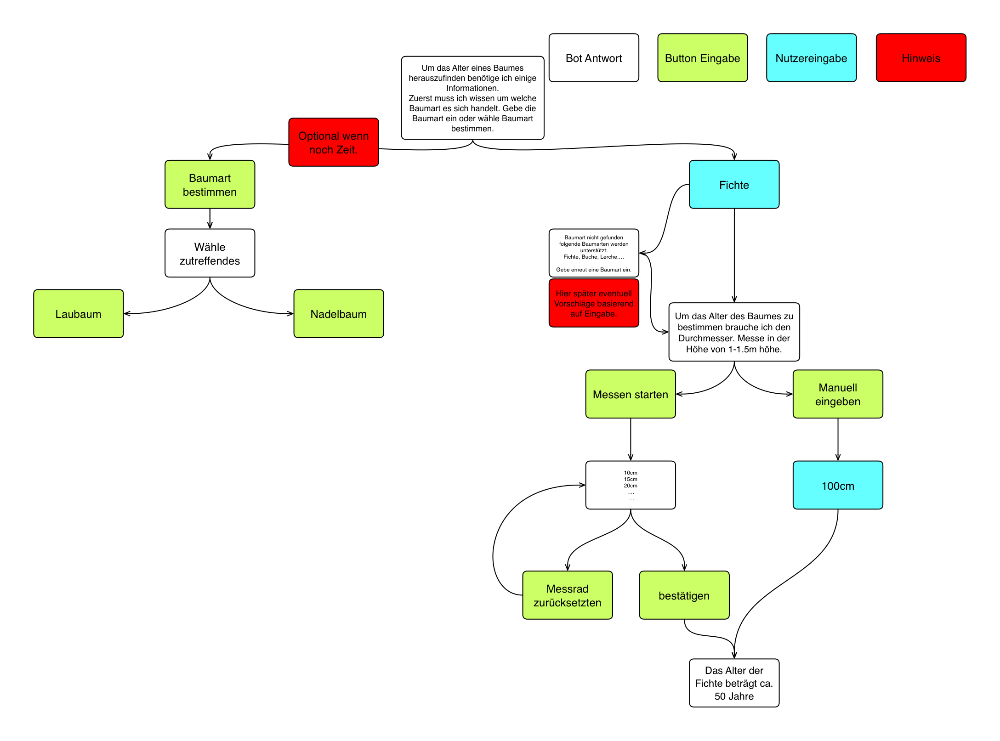

# IFD
Alter von Bäumen bestimmen durch Telegram Bot mithilfe eines Conversational User Interface über den Durchmesser und die Baumart. Dieser soll auf einem ESP32 laufen mit dessen Hilfe soll über einen rotary Encoder der Durchmesser gemessen werden.

## Baumart bestimmen

Die Baumart zu bestimmen ist relativ komplex, da man entsprechende Daten über jeden Baum braucht und diese dann mithilfe eines Abfrageschemas durchgehen muss um den passenden zu finden. Deshalb werde ich erst mal an der Altersbestimmung arbeiten und wenn später zeitlich noch möglich die Bestimmung der Baumart einbauen. 

## Alter bestimmen

Zu beachtende Parameter: Baumart und Durchmesser

### Faktoren für gängige Baumarten:

**Durchmesser in  cm *  **
Eichen und Linden **0,8**  
Eiben und Kastanien **0,7**  
Buchen, Ahorne (nicht Feldahorn), Tannen, und Ulmen **0,6**  
Eschen, Erlen, Fichten, Lärchen, Pappeln, Robinien und Walnussbäumen **0,3** bis **0,5**  
Platanen und Esskastanien **0.4** 
**= Alter in Jahren**

### Messen des Durchmessers mit ESP32
Der Esp32 soll mit einem Messrad den Umfang des Baumes bestimmen. Hierzu gibt es folgendes [Beispiel](https://www.circuitschools.com/diy-measuring-wheel-using-arduino-and-rotary-encoder/).

### Telegram Bot

Der Boot läuft auf dem ESP32 mit dem auch gleichzeitig gemessen wird. Der ESP 32 muss sich hierfür über Wlan im Internet befinden um mit Telegram zu kommunizieren. Die Abfrage aller relevanten Daten erfolgt über das Keyboard das die Bot API anbietet oder über direkte Texteingaben. Im folgenden Flowchart wird der Ablauf erklärt:

